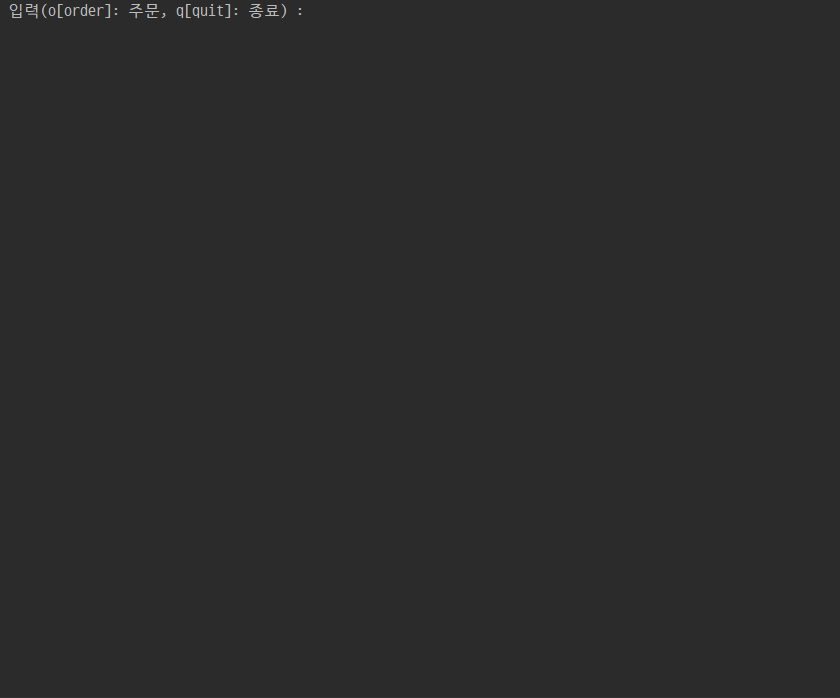
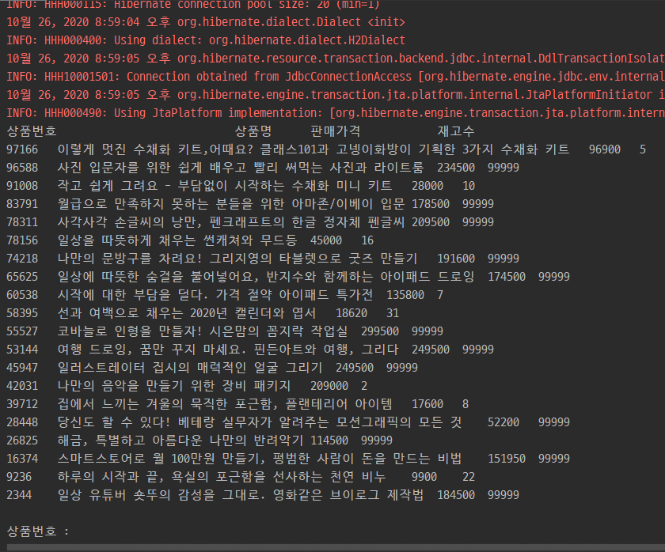
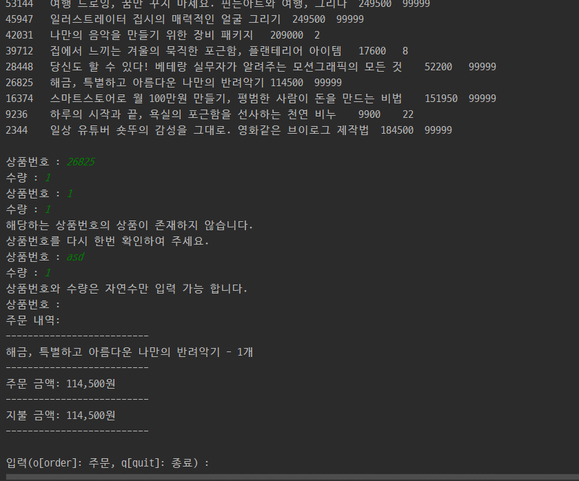
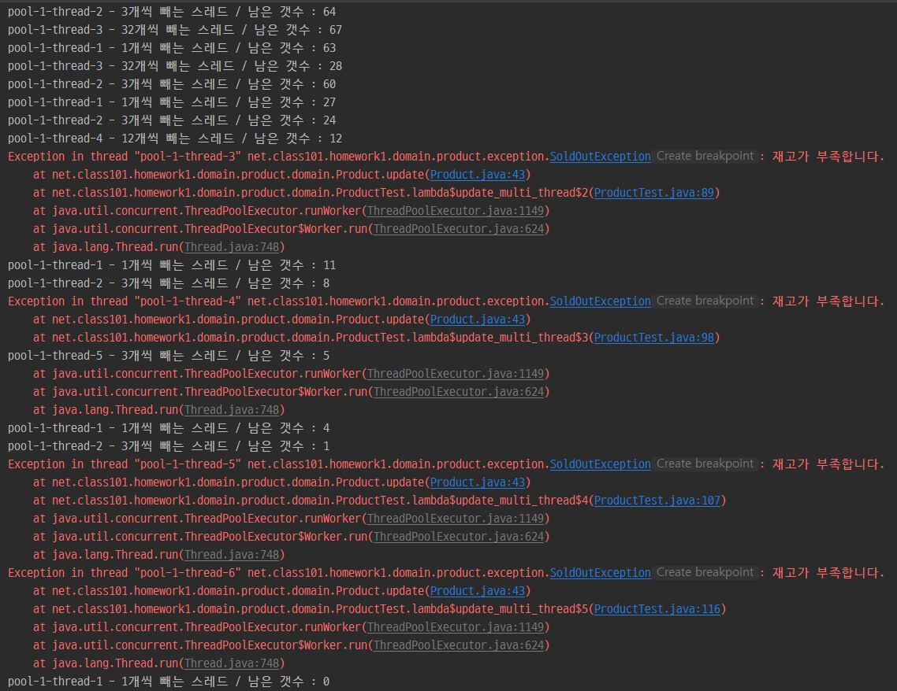
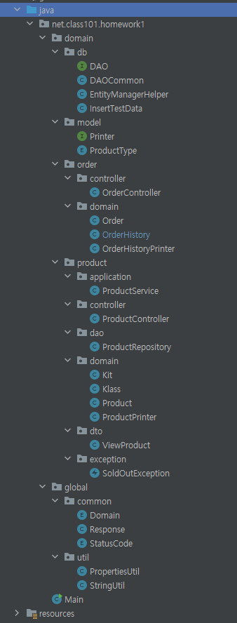

# class101Task

클래스 및 키트 주문 프로그램

## 사용 예시

### 첫 입력

### 주문

### 일반적인 주문

* 한 주문에 같은 클래스는 1 개만 추가 가능합니다.

### 입력 에러

* 입력이 숫자가 아니거나 올바르지 않은 상품 번호를 입력하는 경우 주문 되지 않습니다.
* 주문이 끝나면 다음 주문에선 이전 주문에 추가 했던 클래스를 다시 주문 할 수 있습니다.

### 배송비

* 주문 금액이 5만원 미만인 경우 배송비가 추가 됩니다.

### 멀티 쓰레드 상황에서 SoldOutException

* 현재 남아있는 재고 보다 많이 주문 할 경우 SoldOutException이 발생합니다.

## 프로젝트 구조

* 도메인형 디렉토리 구조로 되어있습니다.
* 크게 각각 도메인을 담당하는 domain 디렉토리, 프로젝트 전체에서 사용되는 설정등을 관리하는 global 디렉토리로 구분 했습니다.
* domain에 있는 model은 도메인 class들에서 공통적으로 사용 할 객체를 모아놓았습니다. 
현재는 상품 타입이 저장된 Enum과 Printer class들이 상속받을 Printer 인터페이스가 존재합니다.
* 각 도메인 안에 존재하는 디렉토리
    1. application : mvc 모델에서 Service에 해당하는 클래스들을 저장합니다. Controller와 DAO의 중간 역할로 로직 흐름의 순서를 정합니다.
    2. controller : mvc 모델에서 Cotroller에 해당하는 클래스들을 저장합니다.
    3. dao : DB와 직접 연결하는 클래스들을 저장합니다.
    4. domain : mvc 모델에서 model에 해당하는 클래스들을 저장합니다. JPA의 Entity class들에 해당합니다. 안에는 해당 도메인의 비즈니스 로직들이 포함됩니다.
    5. dto : controller와 view간 전송되는 dto 클래스들을 저장합니다.
    6. exception : 해당 도메인에서 사용되는 커스텀 익셉션을 저정합니다.